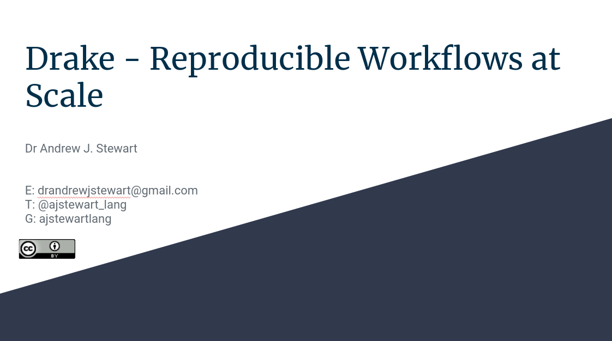

```{r setup, include=FALSE}
knitr::opts_chunk$set(echo = TRUE)
```

# Introduction

When you've written a long script that contains many steps, you probably won't want to re-run the entire script when you've changed just one tiny bit of code. You could manually re-run the bit of code that has changed, and any subsequent code chunks that depend on that - but as your script becomes more complez it can be really hard to keep track of what bits of your script need to be re-run and what bits don't. Indeed, you might make a change to part of your code and then *forget* to re-run the code chunk which includes the change - and then you can get really confused as to why that change hasn't done what you were expecting it to do. Various functions in the {drake} package have been designed to keep track of all of this for you. Using {drake}, you can specify a plan which describes your workflow and how the functions you've written to carry out the steps of your data analysis map onto *targets* in your plan. It's actually a lot simpler than I've probably made it sound. Make sure you've gone through the session on Writing Functions before watching this video introducing {drake} for reproducible workflows.

&nbsp;&nbsp;

<center>

<iframe width="560" height="315" src="https://youtube.com/embed/" frameborder="0" allowfullscreen></iframe>

</center>

&nbsp;&nbsp;

## Slides

You can download the slides in .odp format by clicking [here](../slides/drake_slides.odp) and in .pdf format by clicking on the image below. 
&nbsp;&nbsp;

<center>

[{width=75%}](../slides/drake_slides.pdf)

</center>

&nbsp;&nbsp;

## Additional Resources

Below is a great talk on {drake} by Miles McBain (@MilesMcBain)at the New York Open Statistical Programming Meetup, August 2020. 

&nbsp;&nbsp;

<center>

<iframe width="560" height="315" src="https://youtube.com/embed/jU1Zv21GvT4" frameborder="0" allowfullscreen></iframe>

</center>

&nbsp;&nbsp;

You can access Miles' slides [here](https://nyhackr.blob.core.windows.net/presentations/Miles%20McBain%20-%20That%20feeling%20of%20workflowing.pdf).

## Your Challenge

Using either a script that you have written previously, or a new bit of code with a Tidy Tuesday dataset - or in-built dataset (e.g., Star Wars) - write a set of functions to (e.g.) read in the data, wrangle it as appropriate, visualise it, and build a linear model. With these functions, create a drake plan, make it, visualise the dependencies, and inspect the targets using the `readd()` function. Modify one of your functions, run the function code, and then look to see how things have changed in your dependency visualisation. You should see that the function that you modified is now represented as a black circle and labelled "Outdated". 

## Improve this Workshop

If you spot any issues/errors in this workshop, you can raise an issue or create a pull request for [this repo](https://github.com/ajstewartlang/22_introduction_to_drake). 